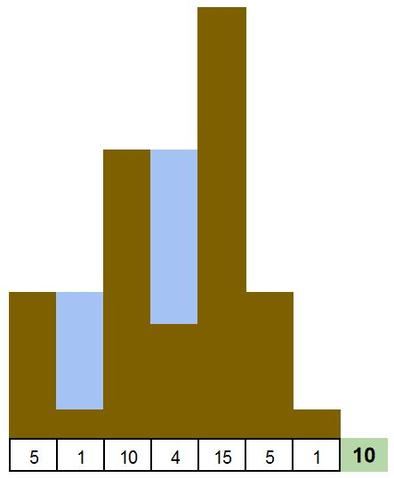

# Software Engineer interview exercise (FAANG)

####_Given a list of integers and considering them as the heights of a graph of bars, calculate how much 'water' can fit in._

To understand the question, let's use an image, it will be clearer

Given the input `[6, 0, 4, 1, 3]`, the result should be `6` units of water 


### Some test cases:





### Answer

To get the answer just run in your terminal, and you will get the implementation
```
git checkout answer
```